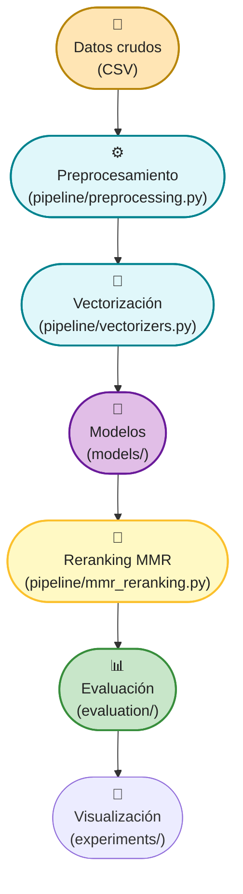
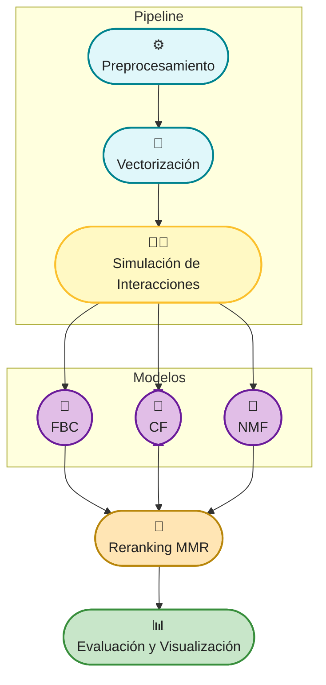

<h1 align="center">
  <br>
  
  <br>
  DogRecSys
  <br>
</h1>

<h4 align="center">Sistema de recomendación de razas de perros</h4>
<h4 align="center">Filtrado basado en contenido, colaborativo, híbrido y reranking</h4>

---

## 📑 Tabla de Contenido

- [Descripción](#🐾-descripción)
- [Arquitectura general](#📐-arquitectura-general)
- [Componentes principales](#🗂️-componentes-principales)
- **Definiciones y algoritmos**
  - [Filtrado Basado en Contenido (FBC)](#filtrado-basado-en-contenido-fbc)
  - [Filtrado Colaborativo (CF)](#filtrado-colaborativo-cf)
  - [NMF (Non-negative Matrix Factorization)](#nmf-non-negative-matrix-factorization)
  - [MMR (Maximal Marginal Relevance)](#mmr-maximal-marginal-relevance)
  - [Métricas de Evaluación](#métricas-de-evaluación)
- **Flujo de trabajo**
  - [Carga y limpieza de datos](#carga-y-limpieza-de-datos)
  - [Vectorización](#vectorización)
  - [Simulación de interacciones](#simulación-de-interacciones)
  - [Entrenamiento y recomendación](#entrenamiento-y-recomendación)
  - [Evaluación](#evaluación)
  - [Experimentación y análisis](#experimentación-y-análisis)
- [Diagramas](#🗺️-diagramas)
- [Recursos Recomendados](#🌐-recursos-recomendados)
- [Autoría](#👤-autoría)
- [Stack Tecnológico](#🛠️-stack-tecnológico)

---

## 🐾 Descripción

DogRecSys es un proyecto de recomendación de razas de perros que explora y combina diferentes enfoques de recomendación, como filtrado basado en contenido, filtrado colaborativo, métodos híbridos y reranking. El objetivo es sugerir razas a usuarios según sus preferencias y características, permitiendo experimentar con distintas técnicas, comparar resultados y visualizar el desempeño de los modelos.

Este repositorio está pensado para documentar, versionar y compartir el desarrollo del sistema, facilitando la revisión y el análisis por parte de tutores o colaboradores. La estructura modular permite entender fácilmente el flujo de datos, la lógica de los modelos y las herramientas de evaluación implementadas.

<div align="center">
  
</div>

---

## 📐 Arquitectura general

```text
DogRecSys/
│
├── data/                  # Datos crudos y preprocesados
├── evaluation/            # Métricas y visualización de resultados
├── experiments/           # Notebooks de experimentación y visualización
├── models/                # Modelos de recomendación
├── pipeline/              # Preprocesamiento, simulación y utilidades
├── old/                   # Notebooks y scripts de experimentos previos
├── 01-data_preparation.ipynb
├── main.py (opcional)
└── README.md
```

---

## 🗂️ Componentes principales

| Carpeta         | Descripción                                                                 |
|-----------------|-----------------------------------------------------------------------------|
| **data/**       | Archivos de datos originales y procesados.                                  |
| **evaluation/** | Funciones y scripts para evaluar y visualizar el desempeño de los modelos.  |
| **experiments/**| Notebooks para experimentación, pruebas y visualización de resultados.      |
| **models/**     | Implementación de los distintos algoritmos de recomendación.                |
| **pipeline/**   | Preprocesamiento, utilidades y componentes reutilizables para el flujo de datos y modelado. |
| **old/**        | Notebooks y scripts de experimentos previos o versiones antiguas.           |

Cada carpeta cuenta con un README propio que detalla su contenido y propósito.

---

## Filtrado Basado en Contenido (FBC)

El filtrado basado en contenido es una técnica que recomienda ítems (en este caso, razas de perros) analizando sus características explícitas y comparándolas con las preferencias declaradas o inferidas del usuario. En DogRecSys, esto implica:

- **Extracción de características:** Se consideran atributos como descripción textual, temperamento, grupo, y variables numéricas (energía, facilidad de entrenamiento, etc.).
- **Vectorización:** Cada raza y cada perfil de usuario se representan como vectores en un espacio de características.
- **Cálculo de similitud:** Se utiliza la similitud de coseno u otras métricas para comparar el vector del usuario con los vectores de las razas.
- **Ranking:** Se ordenan las razas según su similitud con el usuario y se presentan las más afines.

**Ejemplo práctico:**
Si un usuario busca una raza amigable, de bajo mantenimiento y con poca caída de pelo, el sistema priorizará razas con altos valores en esas características, como el Bichón Frisé o el Poodle Toy.

**Aplicaciones típicas:**
- Recomendaciones iniciales para usuarios nuevos (cold start).
- Sugerencias personalizadas en base a filtros explícitos.

---

## Filtrado Colaborativo (CF)

El filtrado colaborativo es una técnica que recomienda ítems basándose en patrones de interacción entre usuarios y elementos. En DogRecSys, se implementa de dos formas:

- **User-based:** Busca usuarios con gustos similares (por ejemplo, que hayan valorado positivamente las mismas razas) y recomienda razas que esos usuarios han preferido pero el usuario actual aún no ha explorado.
- **Item-based:** Encuentra razas que suelen gustar juntas a los mismos usuarios y recomienda aquellas que son similares a las favoritas del usuario.

**Funcionamiento detallado:**
- Se construye una matriz usuario-raza donde cada celda representa la interacción (por ejemplo, rating o preferencia).
- Se calcula la similitud entre usuarios o entre razas usando métricas como coseno o correlación de Pearson.
- Se predicen las preferencias del usuario para razas no vistas y se recomienda el top-K.

**Ejemplo práctico:**
Si un usuario ha mostrado interés en razas de pastoreo y otros usuarios con gustos similares también han valorado positivamente al Border Collie, el sistema recomendará esta raza.

**Ventajas y retos:**
- Descubre patrones no evidentes y puede sorprender al usuario.
- Requiere suficiente cantidad de datos de interacción para ser efectivo.

---

## NMF (Non-negative Matrix Factorization)

NMF es una técnica de reducción de dimensionalidad y factorización de matrices que permite descubrir factores latentes en los datos de interacción usuario-raza. En DogRecSys:

- **Descomposición:** La matriz de ratings se descompone en dos matrices de menor dimensión (usuarios y razas en un espacio latente).
- **Predicción:** Se reconstruye la matriz de preferencias predichas multiplicando las matrices latentes.
- **Recomendación:** Se seleccionan las razas con mayor puntuación predicha para cada usuario.

**Ventajas:**
- Permite recomendaciones incluso con datos dispersos (pocos ratings).
- Descubre relaciones ocultas entre usuarios y razas.

**Ejemplo práctico:**
Un usuario que ha valorado positivamente razas de trabajo y de compañía puede recibir recomendaciones de razas mixtas que comparten factores latentes, aunque no haya interactuado directamente con ellas.

---

## MMR (Maximal Marginal Relevance)

MMR es un algoritmo de reranking que busca equilibrar la relevancia y la diversidad en las recomendaciones. Su funcionamiento en DogRecSys es:

- **Selección inicial:** Se elige la raza más relevante (mayor score o similitud).
- **Iteración:** Para cada siguiente posición, se selecciona la raza que maximiza una combinación ponderada entre su relevancia y su diferencia respecto a las ya seleccionadas.
- **Parámetro de control:** Un parámetro lambda permite ajustar el peso entre relevancia y diversidad.

**Ejemplo práctico:**
Si un usuario recibe recomendaciones de razas pequeñas y amigables, MMR puede incluir una raza de tamaño mediano con características similares para aumentar la variedad y evitar redundancia.

**Aplicaciones:**
- Listas de recomendaciones finales para el usuario.
- Sugerencias en interfaces donde la diversidad es clave (por ejemplo, carrouseles de razas).

---

## Métricas de evaluación

Las métricas permiten medir la calidad, utilidad y experiencia del usuario con las recomendaciones. En DogRecSys se utilizan:

- **Precision@K:** ¿Cuántas de las K recomendaciones son realmente relevantes para el usuario? Útil para medir la exactitud.
- **Recall@K:** ¿Qué porcentaje de todas las razas relevantes para el usuario aparecen en el top-K? Evalúa la cobertura.
- **NDCG@K:** Considera la posición de las recomendaciones relevantes, premiando que aparezcan al inicio de la lista.
- **Diversidad:** Evalúa cuán distintas son las razas recomendadas entre sí, importante para evitar listas homogéneas.
- **Cobertura:** Indica el porcentaje de razas que pueden ser recomendadas por el sistema, útil para medir la amplitud del modelo.

**Ejemplo de uso:**
Tras generar recomendaciones para varios perfiles, se calculan estas métricas y se comparan los resultados entre modelos para elegir el más adecuado según el contexto.

---

## Carga y limpieza de datos

Esta etapa es fundamental para garantizar la calidad de las recomendaciones. Incluye:

- **Carga de datasets:** Importación de archivos CSV con información de razas y ratings de usuarios.
- **Limpieza:** Eliminación o imputación de valores nulos, corrección de inconsistencias y unificación de formatos.
- **Normalización:** Escalado de variables numéricas y codificación de variables categóricas.
- **Documentación:** Registro de los pasos realizados para asegurar reproducibilidad.

**Ejemplo:**
Se eliminan razas con información incompleta y se normalizan los valores de energía y tamaño para que sean comparables entre sí.

---

## Vectorización

La vectorización convierte los datos en formatos numéricos aptos para el procesamiento por los modelos. En DogRecSys:

- **Texto:** Se utiliza TF-IDF para transformar descripciones y temperamento en vectores de palabras.
- **Numérico:** Se aplican técnicas de escalado (StandardScaler, MinMaxScaler) para variables como peso, energía, etc.
- **Combinación:** Se pueden unir vectores de texto y numéricos para crear representaciones completas de cada raza.

**Ejemplo:**
La descripción "raza amigable y activa" se transforma en un vector TF-IDF, mientras que el valor de energía se normaliza entre 0 y 1.

---

## Simulación de interacciones

Cuando no se dispone de suficientes datos reales de usuarios, se pueden simular matrices de interacción usuario-raza:

- **Generación de ratings ficticios:** Se asignan preferencias simuladas a usuarios para probar los modelos colaborativos.
- **Escenarios de prueba:** Permite evaluar el comportamiento del sistema bajo diferentes condiciones (usuarios nuevos, razas nuevas, etc.).

**Ejemplo:**
Se simulan 100 usuarios con preferencias aleatorias y se observa cómo varían las recomendaciones al cambiar los parámetros del modelo.

---

## Entrenamiento y recomendación

En esta fase se ajustan los modelos a los datos y se generan las recomendaciones:

- **Entrenamiento:** Se ajustan los parámetros de los modelos (por ejemplo, factores latentes en NMF, pesos en filtrado basado en contenido).
- **Generación de recomendaciones:** Se calcula el top-K de razas para cada usuario o perfil.
- **Reranking:** Se aplica MMR para diversificar la lista final.

**Ejemplo:**
Tras entrenar un modelo NMF, se recomienda a un usuario las 10 razas con mayor score predicho, aplicando MMR para asegurar variedad.

---

## Evaluación

La evaluación permite comparar modelos y seleccionar el más adecuado:

- **Cálculo de métricas:** Se aplican Precision@K, Recall@K, NDCG@K, etc., sobre las recomendaciones generadas.
- **Visualización:** Se grafican los resultados para identificar fortalezas y debilidades de cada enfoque.
- **Iteración:** Los resultados guían ajustes en los modelos y parámetros.

**Ejemplo:**
Se observa que el modelo basado en contenido tiene mayor precisión, pero menor diversidad que el colaborativo, lo que motiva la combinación de ambos.

---

## Experimentación y análisis

El proyecto incluye notebooks interactivos para:

- **Probar nuevas técnicas:** Se pueden implementar y comparar fácilmente nuevos algoritmos o variantes.
- **Visualizar resultados:** Gráficos y tablas permiten analizar el comportamiento de los modelos.
- **Documentar hallazgos:** Cada experimento queda registrado para futuras referencias.

**Ejemplo:**
Se experimenta con distintos valores de lambda en MMR y se analiza cómo cambia la diversidad de las recomendaciones.

---

## 🗺️ Diagramas

### Diagrama de Arquitectura del Proyecto



### Flujo de datos y componentes



---

## 🌐 Enlaces de interes

<div align="center">

| Recurso | Descripción |
|:---|:---|
| [Recommender Systems Handbook (Springer)](https://link.springer.com/book/10.1007/978-1-4899-7637-6) | Libro de referencia sobre sistemas de recomendación. |
| [A Gentle Introduction to Recommender Systems with Implicit Feedback](https://towardsdatascience.com/a-gentle-introduction-to-recommender-systems-with-implicit-feedback-1e2b1e7a2a3b) | Artículo introductorio sobre recomendaciones con feedback implícito. |
| [Wikipedia: Recommender System](https://en.wikipedia.org/wiki/Recommender_system) | Definición y tipos de sistemas de recomendación. |
| [How to Evaluate Recommender Systems (Google)](https://developers.google.com/machine-learning/recommendation/evaluation) | Guía de Google sobre evaluación de sistemas de recomendación. |
| [Precision and Recall Explained Visually](https://www.machinelearningplus.com/evaluation/precision-recall-classification/) | Explicación visual de precisión y recall en clasificación. |

</div>

---

## 👤 Autoría

<div align="center">

<strong>DogRecSys</strong> es un proyecto de maestría en desarrollo por <b>Jose Enrique Rojas</b>.<br>

Este repositorio está diseñado para documentar, versionar y compartir el avance del sistema de recomendación de razas de perros, facilitando su revisión, análisis y evolución.

</div>

---

## 🛠️ Stack tecnológico

DogRecSys está construido con las siguientes tecnologías y librerías:

| Herramienta / Librería | Uso principal |
|------------------------|--------------|
| <b>Python 3.12+</b>    | Lenguaje principal del proyecto |
| <b>pandas</b>          | Manipulación y análisis de datos |
| <b>scikit-learn</b>    | Modelado, métricas y preprocesamiento |
| <b>NumPy</b>           | Operaciones numéricas y matrices |
| <b>matplotlib / seaborn</b> | Visualización de resultados |
| <b>Jupyter Notebook</b>| Experimentación y análisis interactivo |
| <b>spaCy</b>           | Procesamiento de lenguaje natural (NLP) |
| <b>Mermaid.js</b>      | Diagramas visuales en Markdown |

<br>
<br>

<p align="center">
  <a href="https://skillicons.dev">
    
  </a>
</p>
